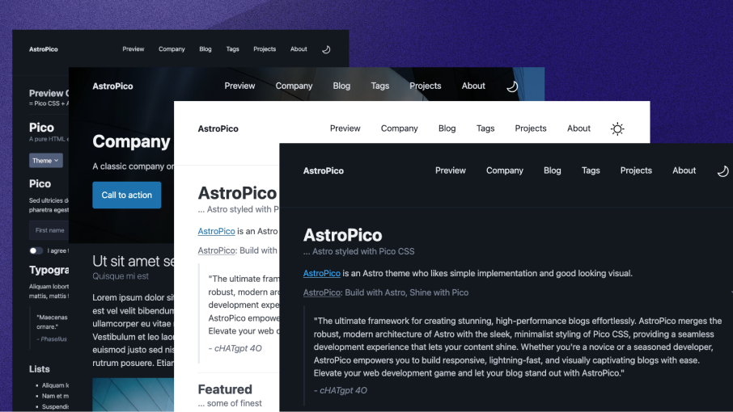

# AstroPico: Build with Astro, Shine with Pico



AstroPico, an [Astro](https://docs.astro.build/) styled with [Pico CSS](https://picocss.com/), is a static, minimal, lightweight, fast, responsive Astro theme for blog or simple web for those who likes simple implementation and good looking visual.

## 📖 Installation
```sh
npm create astro@latest -- --template san-ghun/astro-pico
```
<details>
    <summary>additional options</summary>
    
```sh
# npm 6.x
npm create astro@latest --template san-ghun/astro-pico

# yarn
yarn create astro --template san-ghun/astro-pico
```

</details>

## 📋 Features

- [x] Build with [Astro](https://docs.astro.build/)
- [x] Style with [Pico CSS](https://picocss.com/)
- [x] Light/Dark Theme
- [x] Fast loading
- [x] Responsive
- [x] Typesafe
- [x] Markdown support (blog post)
- [x] MDX support (project post)
- [x] Auto generated RSS Feed
- [x] Auto generated sitemap
- [ ] SEO-friendly
- [ ] Pagination
- [ ] Accessible

## 💻 Tech Stack

- **Main Framework** - [Astro](https://astro.build/)
- **Type Checking** - [TypeScript](https://www.typescriptlang.org/)  
- **Component Framework** - [Astro](https://astro.build/) & [ReactJS](https://reactjs.org/)  
- **Styling** - [Pico CSS](https://picocss.com/)  
- **Icons** - [Tablers](https://tabler-icons.io/)  
- **Code Formatting** - [Prettier](https://prettier.io/)  
- **Deployment** - [Netlify](https://netlify.com/)  

## 🚀 Project Structure

Inside of your Astro project, you'll see the following folders and files:

```text
/
├── public/
│   ├── assets/projects/
│   │   ├── project01/
│   │   └── project02/
│   └── favicon.svg
├── src/
│   ├── assets/
│   ├── components/
│   │   ├── preview/
│   │   ├── *.astro
│   │   └── *.jsx
│   ├── content/
│   │   ├── posts/
│   │   │   ├── *.md
│   │   └── config.ts/
│   ├── icons/
│   │   ├── social/
│   │   └── rss.svg
│   ├── layouts/
│   │   └── *Layout.astro
│   ├── pages/
│   │   ├── posts/
│   │   ├── projects/
│   │   │   └── *.mdx
│   │   ├── tags/
│   │   ├── index.astro
│   │   ├── 404.astro
│   │   └── rss.xml.js
│   ├── scripts/
│   ├── styles/
│   └── env.d.ts
├── astro.config.mjs
├── tsconfig.json
└── package.json
```

Astro looks for `.astro` or `.md` files in the `src/pages/` directory. Each page is exposed as a route based on its file name.

There's nothing special about `src/components/`, but that's where we like to put any Astro/React/Vue/Svelte/Preact components.

Any static assets, like images, can be placed in the `public/` directory, or can be placed in the `src/assets` directory, if you prefer.

> We recommend that local images are kept in `src/` when possible so that Astro can transform, optimize and bundle them. Files in the `/public` directory are always served or copied into the build folder as-is, with no processing.
>
> Your local images stored in `src/` can be used by all files in your project: .astro, .md, .mdx, .mdoc, and other UI frameworks. Images can be stored in any folder, including alongside your content.
>
> Store your images in the `public/` folder if you want to avoid any processing or to have a direct public link to them.
>
> -- <cite>Astro Docs</cite>

## 🧞 Commands

All commands are run from the root of the project, from a terminal:

| Command                   | Action                                           |
| :------------------------ | :----------------------------------------------- |
| `npm install`             | Installs dependencies                            |
| `npm run dev`             | Starts local dev server at `localhost:4321`      |
| `npm run build`           | Build your production site to `./dist/`          |
| `npm run preview`         | Preview your build locally, before deploying     |
| `npm run astro ...`       | Run CLI commands like `astro add`, `astro check` |
| `npm run astro -- --help` | Get help using the Astro CLI                     |

## 👀 Want to learn more?

Feel free to check [our demo](https://astro-pico.netlify.app/) or jump into [Astro Docs](https://docs.astro.build/) and [Pico CSS](https://picocss.com/).

## ✨ Feedback & Suggestions

Feel free to open an [issue](https://github.com/san-ghun/astro-pico/issues/) if you find bugs or want to request new features.

## 🌟 Polaris: our goal & guideline

> **Build with Astro, Shine with Pico**
>
> "The ultimate framework for creating stunning, high-performance blogs effortlessly. AstroPico merges the robust, modern architecture of Astro with the sleek, minimalist styling of Pico CSS, providing a seamless development experience that lets your content shine. Whether you're a novice or a seasoned developer, AstroPico empowers you to build responsive, lightning-fast, and visually captivating blogs with ease. Elevate your web development game and let your blog stand out with AstroPico."
>
> -<cite>cHATgpt 4O</cite>

> **Lightweight & Looks Great**
>
> "The perfect solution for creating stylish, high-performance blogs with minimal effort. AstroPico combines the powerful, component-based architecture of Astro with the elegant simplicity of Pico CSS, delivering a seamless and enjoyable development experience. Whether you're a seasoned developer or just starting, AstroPico enables you to build responsive, fast-loading, and visually appealing blogs effortlessly. Embrace the future of web development with AstroPico, where performance meets aesthetic excellence."
>
> -<cite>ChAtGpT Fo</cite>

> **Lightweight (or Right-way) for a Stylish but Lazy Astronaut**
>
> "The perfect blend of efficiency and style for modern web development. AstroPico leverages the powerful, flexible architecture of Astro and the minimalist elegance of Pico CSS, allowing you to create beautiful, high-performance blogs with minimal effort. Designed for developers who value simplicity and aesthetics, AstroPico ensures your blog not only loads quickly but also looks stunning. Embrace the smart, effortless way to build and style your blog with AstroPico, where even the laziest astronaut can achieve stellar results."
>
> -<cite>cHaTgPt fO</cite>

## 📜 License

MIT, 
Copyright © 2023-present
